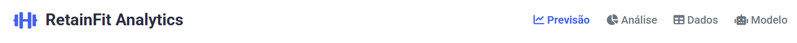
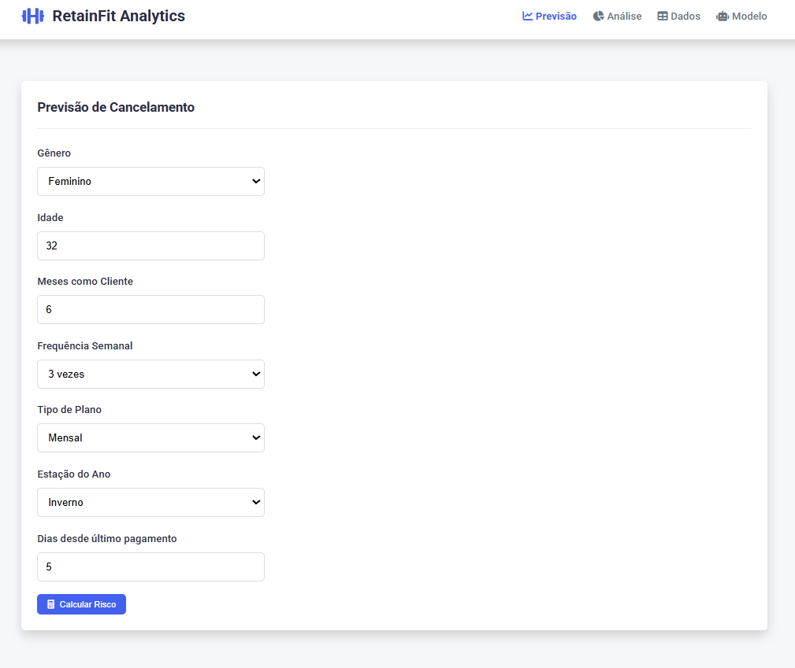
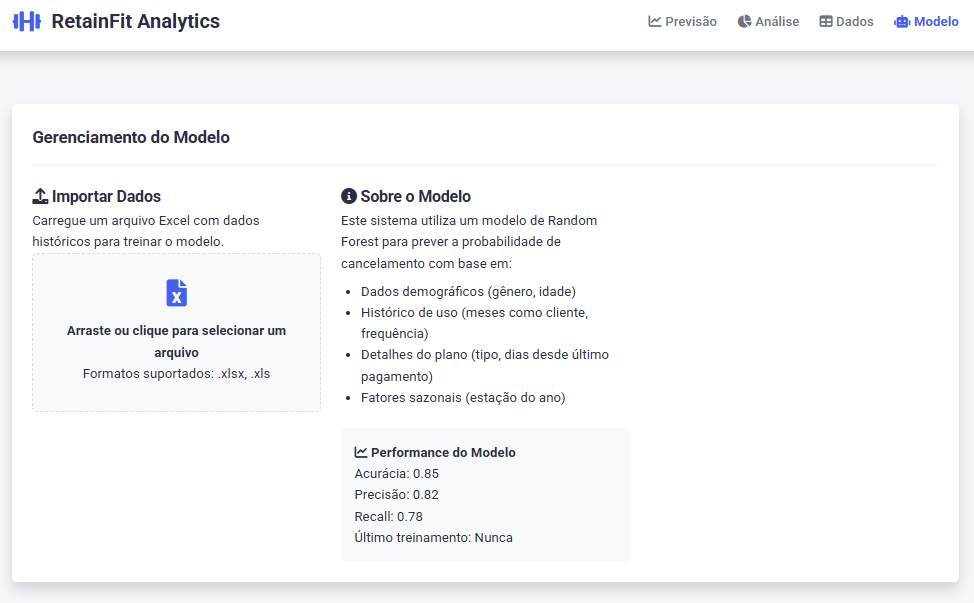
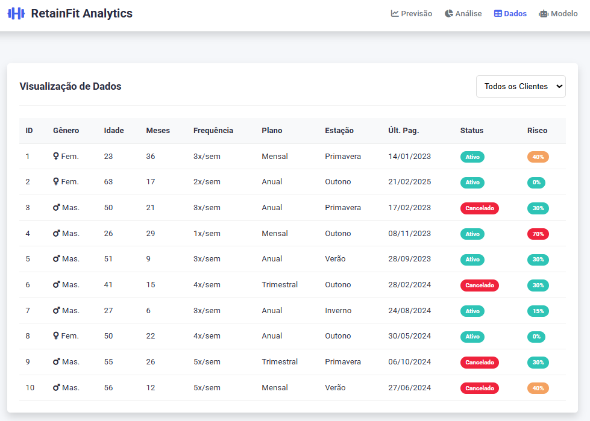
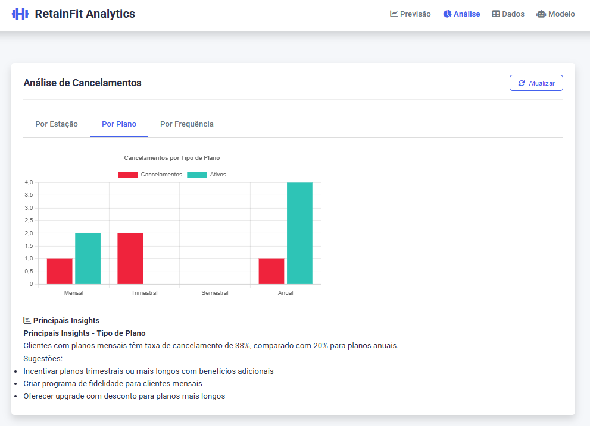
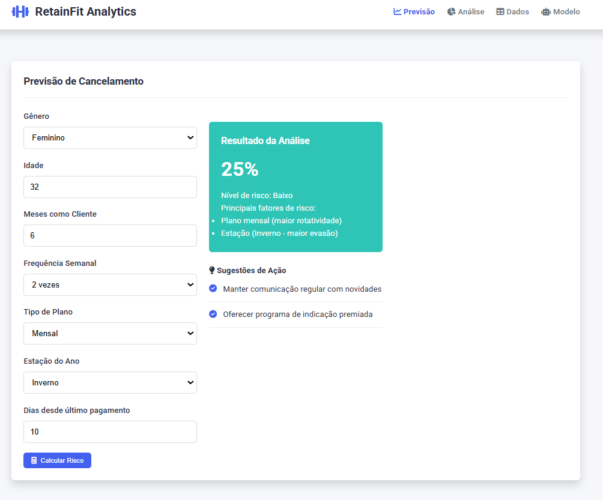
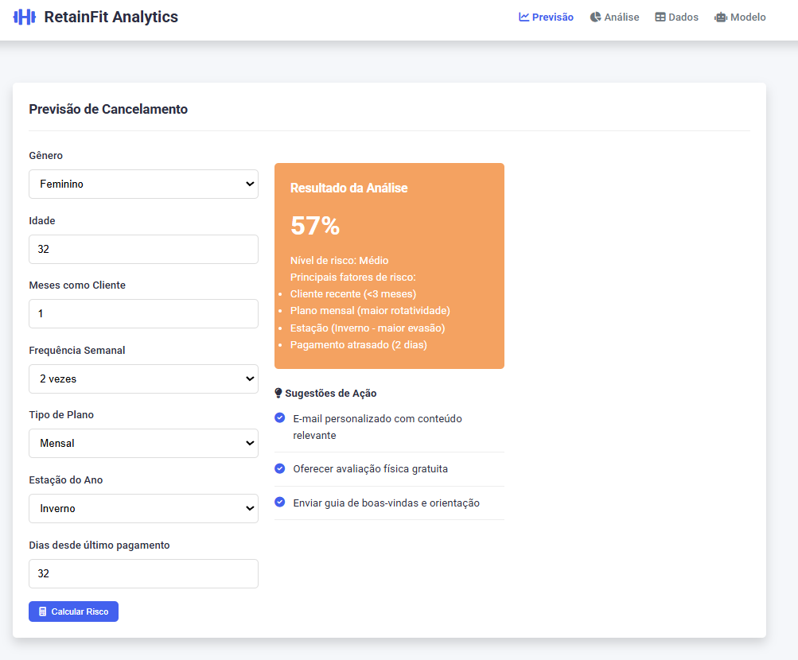
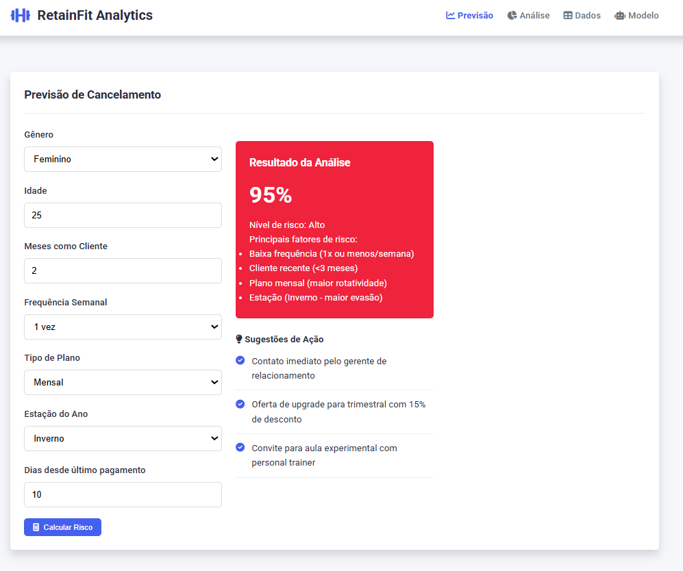

# RetainFit Analytics - Sistema de Predição de Evasão em Academias

## 📌 Visão Geral

- **Modelo preditivo** baseado em dados históricos
- **Análise visual** de fatores de risco
- **Sugestões personalizadas** para retenção de clientes
- **Painel administrativo** completo

## ✨ Funcionalidades Principais

### 🔮 Módulo de Predição
- Calcula probabilidade de cancelamento em tempo real
- Considera 7 fatores de risco principais
- Classifica o risco em 3 níveis (Alto, Médio, Baixo)

### 📊 Módulo de Análise
- Gráficos interativos por:
  - Tipo de plano
  - Estação do ano
  - Frequência semanal
- Principais insights automáticos

### 📋 Módulo de Dados
- Tabela dinâmica com filtros:
  - Todos clientes
  - Ativos
  - Cancelados
  - Alto risco
- Importação de planilhas Excel

## 🛠️ Tecnologias Utilizadas

| Tecnologia        | Descrição                    |
|-------------------|------------------------------|
| HTML5             | Estrutura do sistema         |
| CSS3              | Estilização e layout         |
| JavaScript ES6+   | Lógica e interações          |
| Chart.js          | Visualização de dados        |
| SheetJS (xlsx)    | Leitura de arquivos Excel    |

## 🚀 Como Usar

### Pré-requisitos
- Navegador moderno (Chrome, Firefox, Edge)
- Arquivo Excel no formato especificado (opcional)

### Instruções
1. **Previsão Individual**:
   - Preencha o formulário na aba "Previsão"
   - Obtenha o risco calculado e ações recomendadas

2. **Análise Geral**:
   - Navegue pelas abas de análise
   - Visualize gráficos por diferentes categorias

3. **Importar Dados**:
   - Na aba "Modelo", arraste um arquivo Excel
   - Sistema treinará com os novos dados

4. **Visualização**:
   - Use filtros na aba "Dados" para diferentes visualizações

## 📈 Modelo Preditivo

### Fatores Considerados
1. Dados demográficos (gênero, idade)
2. Histórico de uso (meses como cliente, frequência)
3. Detalhes do plano (tipo, dias desde último pagamento)
4. Fatores sazonais (estação do ano)

### Lógica de Atraso

| Tipo de Plano | Dias para Considerar Atraso |
|---------------|-----------------------------|
| Mensal        | 30+ dias                    |
| Trimestral    | 90+ dias                    |
| Semestral     | 180+ dias                   |
| Anual         | 365+ dias                   |

## 🖼️ Galeria de Imagens 

Abaixo estão alguns prints do sistema, organizados por funcionalidade:

| 🏠 Tela Inicial | 📤 Upload e Modelo Preditivo |
|-----------------|------------------------------|
|  |  |

| 📋 Visualização de Dados | 📊 Análise de Tendências |
|---------------------------|---------------------------|
|  |  |

| ✅ Risco Baixo | ⚠️ Risco Médio | ❌ Risco Alto |
|---------------|----------------|---------------|
|  |  |  |

## 📝 Licença

Este projeto está licenciado sob a **Apache License 2.0**.  
Você pode usá-lo, modificá-lo e distribuí-lo, desde que siga os termos da licença.

Para mais detalhes, consulte o arquivo [LICENSE](./LICENSE).

---

&copy; 2025 RetainFit Analytics — Todos os direitos reservados.  
Desenvolvido com 💙 por Avril.

