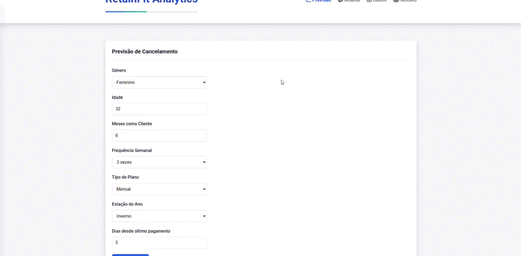

# RetainFit Analytics

  

Bem-vindo ao **RetainFit Analytics**, um protótipo funcional de um sistema inteligente projetado para ajudar academias a entender e reduzir a evasão de alunos através da análise preditiva.

## ⚠️ Aviso Importante sobre este Protótipo

Este projeto foi desenvolvido como parte de um desafio acadêmico (Talento Tech-PR) com o objetivo de explorar e demonstrar como a Inteligência Artificial poderia ser aplicada para solucionar o problema de retenção de clientes em academias.

**O sistema atual é um protótipo funcional que SIMULA o comportamento de um modelo preditivo de IA.** No momento, **não há um modelo de aprendizado de máquina real implementado e treinado em execução.**

As previsões, análises de risco e o "treinamento do modelo" ao importar dados são gerados por um conjunto de regras e heurísticas pré-definidas. Estas simulações foram desenhadas para espelhar a lógica e os resultados que um modelo de IA real, como o Random Forest, proporcionaria.

Este repositório e a aplicação hospedada têm fins educacionais, de demonstração do conceito e validação da interface e da proposta de valor.

## 🎯 Visão Geral do Projeto

O RetainFit Analytics visa fornecer aos gestores de academia uma ferramenta intuitiva para:

-   **Simular predições** de risco de cancelamento de alunos.
-   Oferecer **análises visuais** dos fatores que (na simulação) contribuem para a evasão.
-   Gerar **sugestões de ações** para engajamento e retenção de clientes.
-   Facilitar a **gestão e visualização de dados** de alunos através de um painel administrativo.

## 📌 Funcionalidades Demonstradas no Protótipo

### 🔮 Previsão (Simulada)
-   Calcula uma probabilidade de cancelamento com base nos dados inseridos.
-   A simulação considera 7 fatores de risco principais.
-   Classifica o risco em 3 níveis (Alto, Médio, Baixo) e oferece sugestões de ação baseadas em regras.

### 📈 Análise de Dados
-   Gera gráficos interativos a partir dos dados carregados, segmentados por:
    -   Estação do ano
    -   Tipo de plano
    -   Frequência semanal
-   Apresenta "insights" baseados na distribuição dos dados visualizados.

### 📋 Gestão de Dados
-   Permite a visualização de uma lista de clientes (impotados pela tabela).
-   Oferece filtros dinâmicos para segmentar a visualização (Todos, Ativos, Cancelados, Alto Risco Simulado).

### 🤖 "Modelo" e Importação de Dados
-   Permite o upload de arquivos Excel (.xlsx, .xls) ou CSV (.csv) contendo dados de clientes.
-   O "treinamento do modelo" após o upload é uma **simulação**: o sistema processa os dados, atualiza suas visualizações e simula a atualização das métricas de um modelo.

## 🛠️ Tecnologias Utilizadas

  
  
  
  
  

## 🚀 Status do Desenvolvimento e Próximos Passos

Como mencionado, esta é uma versão de protótipo com IA simulada. Nossa visão para o futuro do RetainFit Analytics inclui:

1.  **Implementação de um Modelo de IA Real:**
    *   Coleta e preparação de um conjunto de dados anonimizados e representativos.
    *   Treinamento e validação de um modelo de aprendizado de máquina (ex: Random Forest, Gradient Boosting) para prever o churn com precisão.
    *   Integração deste modelo à plataforma, substituindo a lógica de simulação atual.
2.  **Refinamento das Análises e Insights:** Com um modelo real, os insights seriam gerados com base nos padrões aprendidos pelos algoritmos.
3.  **Expansão das Funcionalidades:** Considerar features como alertas automáticos, integração com outras ferramentas de gestão, etc.

Agradecemos o interesse no projeto e qualquer feedback sobre o protótipo atual!

## 🧭 Como Usar o Protótipo

### Pré-requisitos
-   Navegador moderno (Chrome, Firefox, Edge, Safari).
-   (Opcional) Um arquivo Excel (.xlsx, .xls) ou CSV (.csv) com dados de alunos para testar a funcionalidade de importação. Um exemplo de formato pode ser encontrado no [Manual do Usuário](LINK_PARA_O_MANUAL_SE_TIVER).

### 1. Importar Dados (para simular o treinamento)
-   Navegue até a aba **"Modelo"**.
-   Clique na área de "Importar Dados" ou arraste seu arquivo para ela.
-   Aguarde o processamento. O sistema simulará o treinamento e atualizará as métricas e a tabela de dados.

### 2. Fazer Previsões Individuais (Simuladas)
-   Acesse a aba **"Previsão"**.
-   Preencha os campos do formulário com os dados de um cliente (real ou fictício).
-   Clique em **"Calcular Risco"**.
-   O sistema exibirá um percentual de risco simulado, os fatores considerados pela simulação e sugestões de ação baseadas em regras.

### 3. Explorar Análises de Dados
-   Vá para a aba **"Análise"**.
-   Selecione diferentes visualizações (Por Estação, Por Plano, Por Frequência) para ver gráficos gerados a partir dos dados carregados (ou dos dados fictícios iniciais).

### 4. Visualizar a Base de Dados
-   Acesse a aba **"Dados"**.
-   Consulte a lista de clientes e utilize os filtros para segmentar a visualização. O risco exibido aqui também será o simulado.

## 📈 Lógica da Simulação Preditiva

A simulação de risco neste protótipo considera os seguintes fatores principais e uma lógica de pontuação pré-definida:

1.  **Dados Demográficos:** Gênero, Idade.
2.  **Histórico de Uso:** Meses como cliente, Frequência semanal.
3.  **Detalhes do Plano:** Tipo de plano.
4.  **Pagamento:** Dias desde o último pagamento (calculando dias em atraso).
5.  **Fatores Sazonais:** Estação do ano.

### Lógica de Cálculo de Dias em Atraso (Usada na Simulação):

| Tipo de Plano | Dias para Considerar Atraso |
|---------------|-----------------------------|
| Mensal        | 30+ dias                    |
| Trimestral    | 90+ dias                    |
| Semestral     | 180+ dias                   |
| Anual         | 365+ dias                   |

## 🤝 Equipe Desenvolvedora (Talento Tech-PR)

*   Avril de Castro Stihler ([LinkedIn](URL_DO_LINKEDIN_AVRIL))
*   Rayanne Cordeiro ([LinkedIn](URL_DO_LINKEDIN_RAYANNE))
*   Kaline dos Anjos Marche ([LinkedIn](URL_DO_LINKEDIN_KALINE))
*   Poliana Aparecida de Paula ([LinkedIn](URL_DO_LINKEDIN_POLIANA))

## 📝 Licença

Este projeto está licenciado sob a [Creative Commons Atribuição-NãoComercial 4.0 Internacional (CC BY-NC 4.0)](https://creativecommons.org/licenses/by-nc/4.0/).
O uso comercial do código, ideia ou estrutura do sistema é **proibido** sem autorização prévia das autoras.

Para mais detalhes, consulte o arquivo `LICENSE` neste repositório.

---

© 2024 RetainFit Analytics — Protótipo para fins educacionais e de demonstração.  
Desenvolvido pela equipe Talento Tech-PR: Avril Stihler, Rayanne Cordeiro, Kaline Marche, Poliana de Paula.

